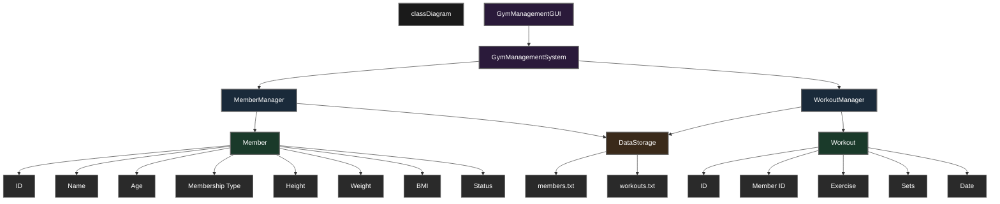

# Gym Management System

A modern JavaFX-based Gym Management System for efficiently managing gym members, tracking workouts, and monitoring fitness progress.

## Features

- Modern GUI with Dark Theme
- Member Registration and Management
- Workout Tracking System
- BMI Calculator
- Member Information Display
- Data Persistence using File Storage
- Real-time Updates

## Project Structure

```
GYM_MANAGEMENT_SYSTEM/
├── src/main/java/gym_management_system/  # Source code directory
│   ├── GymManagementGUI.java            # Main GUI application
│   ├── GymManagementSystem.java         # Core system logic
│   ├── Member.java                      # Member model
│   ├── Workout.java                     # Workout model
│   ├── MemberManager.java               # Member management
│   ├── WorkoutManager.java              # Workout management
│   └── DataStorage.java                 # Data persistence
├── pom.xml                              # Maven configuration
├── README.md                            # Documentation
└── .gitignore                           # Git ignore rules
```

## System Architecture and File Connections

```mermaid
classDiagram
    %% Theme Configuration
    classDiagram
        class GymManagementGUI {
            -memberManager: MemberManager
            -workoutManager: WorkoutManager
            +start(Stage primaryStage)
            +showRegisterMemberDialog()
            +showRecordWorkoutDialog()
            +showCalculateBMIDialog()
            +showMemberInfoDialog()
        }

        class GymManagementSystem {
            -memberManager: MemberManager
            -workoutManager: WorkoutManager
            +addMember(Member)
            +removeMember(Member)
            +recordWorkout(int, String, int)
            +getMemberWorkouts(int)
        }

        class MemberManager {
            -members: List~Member~
            +registerNewMember(String, int, String)
            +getMember(int)
            +getAllMembers()
            +updateMember(int, String, int, String)
        }

        class WorkoutManager {
            -workouts: List~Workout~
            -memberManager: MemberManager
            +recordWorkout(int, String, int)
            +getWorkoutHistory(int)
        }

        class Member {
            -id: int
            -name: String
            -age: int
            -membershipType: String
            -height: double
            -weight: double
            -bmi: double
            +calculateBMI()
            +getBMIStatus()
        }

        class Workout {
            -id: int
            -memberId: int
            -exercise: String
            -sets: int
            -date: String
        }

        class DataStorage {
            -MEMBERS_FILE: String
            -WORKOUTS_FILE: String
            +saveMembers(List~Member~)
            +loadMembers()
            +saveWorkouts(List~Workout~)
            +loadWorkouts()
        }

        GymManagementGUI --> GymManagementSystem : uses
        GymManagementSystem --> MemberManager : manages
        GymManagementSystem --> WorkoutManager : manages
        MemberManager --> Member : creates/manages
        WorkoutManager --> Workout : creates/manages
        MemberManager --> DataStorage : saves/loads
        WorkoutManager --> DataStorage : saves/loads
        WorkoutManager --> MemberManager : validates

    %% Style Configuration
    classDef default fill:#1a1a1a,stroke:#666,stroke-width:2px,color:#fff
    classDef main fill:#2a1a3a,stroke:#666,stroke-width:2px,color:#fff
    classDef manager fill:#1a2a3a,stroke:#666,stroke-width:2px,color:#fff
    classDef model fill:#1a3a2a,stroke:#666,stroke-width:2px,color:#fff
    classDef storage fill:#3a2a1a,stroke:#666,stroke-width:2px,color:#fff

    %% Apply Styles
    class GymManagementGUI,GymManagementSystem main
    class MemberManager,WorkoutManager manager
    class Member,Workout model
    class DataStorage storage
```

## Class Hierarchy and Connections



### Class Hierarchy Explanation

1. **Top Level (GUI & System)**
   - `GymManagementGUI`: User interface layer
   - `GymManagementSystem`: Core system coordinator

2. **Management Layer**
   - `MemberManager`: Handles member operations
   - `WorkoutManager`: Handles workout operations

3. **Data Models**
   - `Member`: Stores member information
     - Basic info (ID, Name, Age)
     - Physical attributes (Height, Weight, BMI)
     - Status info (Membership Type, Status)
   - `Workout`: Stores workout information
     - Exercise details (Exercise, Sets)
     - Tracking info (ID, Member ID, Date)

4. **Data Storage**
   - `DataStorage`: Manages file operations
     - `members.txt`: Stores member data
     - `workouts.txt`: Stores workout data

### Data Flow Paths

1. **Member Registration Path**
   ```
   GUI → System → MemberManager → Member → DataStorage → members.txt
   ```

2. **Workout Recording Path**
   ```
   GUI → System → WorkoutManager → MemberManager (validation) → Workout → DataStorage → workouts.txt
   ```

3. **Data Retrieval Path**
   ```
   DataStorage → Member/Workout → Manager → System → GUI
   ```

## Team Responsibilities

### 1. Sajal Kumar (Team Lead & Frontend Developer)
**Files Responsible For:**
- `GymManagementGUI.java`
- Project Setup and Configuration
- `pom.xml`

**Tasks:**
- ✅ Design and implement the modern dark-themed GUI
- ✅ Create responsive user interface components
- ✅ Implement event handlers for all GUI elements
- ✅ Manage project dependencies and build configuration
- ✅ Coordinate between team members
- ✅ Code review and quality assurance

### 2. Akash (Backend Developer - Member Management)
**Files Responsible For:**
- `Member.java`
- `MemberManager.java`
- Unit Tests for Member-related functionality

**Tasks:**
- ✅ Implement member data model with all required attributes
- ✅ Create member management logic (CRUD operations)
- ✅ Implement BMI calculation functionality
- ✅ Handle member validation and error checking
- ✅ Write unit tests for member-related features
- ✅ Document member management API

### 3. Kunal (Backend Developer - Workout Management)
**Files Responsible For:**
- `Workout.java`
- `WorkoutManager.java`
- Unit Tests for Workout-related functionality

**Tasks:**
- ✅ Design workout tracking system
- ✅ Implement workout recording and history
- ✅ Create workout statistics and reporting
- ✅ Handle workout validation and error checking
- ✅ Write unit tests for workout-related features
- ✅ Document workout management API

### 4. Devansh (Data Management & Integration)
**Files Responsible For:**
- `DataStorage.java`
- `GymManagementSystem.java`
- System Integration Tests

**Tasks:**
- ✅ Implement data persistence layer
- ✅ Create file handling mechanisms
- ✅ Manage data format and storage
- ✅ Handle data validation and error recovery
- ✅ Integrate all system components
- ✅ Write system integration tests

## Build and Run Instructions

1. Ensure you have Java 17 and Maven installed
2. Clone the repository
3. Navigate to the project directory
4. Run the following commands:

```bash
mvn clean install
mvn javafx:run
```

## Development Guidelines

1. **Code Style**
   - Follow Java naming conventions
   - Add comments for complex logic
   - Keep methods focused and concise

2. **Git Workflow**
   - Create feature branches from main
   - Use descriptive commit messages
   - Request code reviews before merging

3. **Testing**
   - Write unit tests for new features
   - Ensure all tests pass before committing
   - Test GUI components manually

## Dependencies

- Java 17
- JavaFX 17.0.2
- Maven 3.8+

## Future Enhancements

1. **Phase 1 (Aksh)**
   - Enhanced UI/UX features
   - Dark/Light theme toggle
   - Responsive design improvements

2. **Phase 2 (Sajal)**
   - Advanced member analytics
   - Membership renewal notifications
   - Custom membership plans

3. **Phase 3 (Kunal)**
   - Workout plan recommendations
   - Progress tracking graphs
   - Exercise library

4. **Phase 4 (Devansh)**
   - Database integration
   - Backup and restore functionality
   - Data export features

## Contact Information

- **Sajal Kumar** (Team Lead) - sajalkumar1765@gmail.com
- **Akash** (Member Management) - [Add Email]
- **Kunal** (Workout Management) - [Add Email]
- **Devansh** (Data Management) - [Add Email]

## License

© 2024 Team GMS. All rights reserved. 